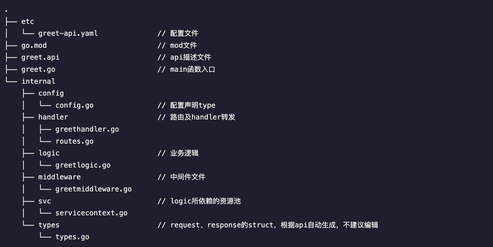

# api 目录


```go
.
├── etc
│   └── greet-api.yaml              // 配置文件
├── go.mod                          // mod文件
├── greet.api                       // api描述文件
├── greet.go                        // main函数入口
└── internal                        
    ├── config  
    │   └── config.go               // 配置声明type
    ├── handler                     // 路由及handler转发
    │   ├── greethandler.go
    │   └── routes.go
    ├── logic                       // 业务逻辑
    │   └── greetlogic.go
    ├── middleware                  // 中间件文件
    │   └── greetmiddleware.go
    ├── svc                         // logic所依赖的资源池
    │   └── servicecontext.go
    └── types                       // request、response的struct，根据api自动生成，不建议编辑
        └── types.go
```

# rpc 目录

go-zero rpc目录结构
2022-04-25 17:47 更新

proto 文件 

- greet.proto


```go

syntax = "proto3";

package stream;

option go_package = "./greet";

message StreamReq {
  string name = 1;
}

message StreamResp {
  string greet = 1;
}

service StreamGreeter {
  rpc greet(StreamReq) returns (StreamResp);
}

```

- goctl rpc proto

```go

$ goctl rpc protoc greet.proto --go_out=. --go-grpc_out=. --zrpc_out=.                                                                                               
[goctl-env]: preparing to check env

[goctl-env]: looking up "protoc"
[goctl-env]: "protoc" is installed

[goctl-env]: looking up "protoc-gen-go"
[goctl-env]: "protoc-gen-go" is installed

[goctl-env]: looking up "protoc-gen-go-grpc"
[goctl-env]: "protoc-gen-go-grpc" is installed

[goctl-env]: congratulations! your goctl environment is ready!
[command]: protoc greet.proto --go_out=. --go-grpc_out=.
Done.

```

- 生成的目录结构

```bash
.
├── etc
│   └── greet.yaml
├── go.mod
├── go.sum
├── greet // [1]
│   ├── greet.pb.go
│   └── greet_grpc.pb.go
├── greet.go
├── greet.proto
├── internal
│   ├── config
│   │   └── config.go
│   ├── logic
│   │   └── greetlogic.go
│   ├── server
│   │   └── streamgreeterserver.go
│   └── svc
│       └── servicecontext.go
└── streamgreeter
    └── streamgreeter.go

```


pb.go & _grpc.pb.go 文件所在目录并非固定，该目录有 go_opt & go-grpc_opt 与 proto文件中的 go_package 值共同决定


